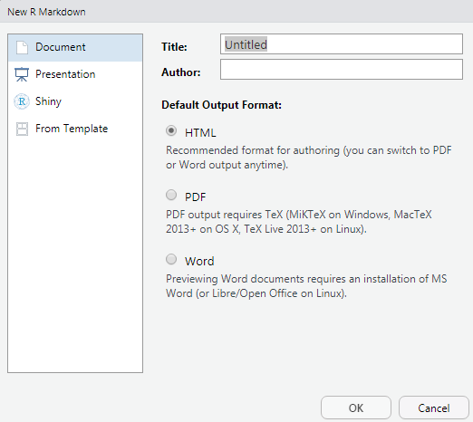
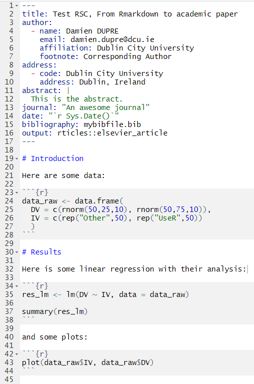

```{css, echo=FALSE}
.remark-code {
  font-size: 12px;
  overflow-x: scroll;
}
```


```{r setup, include=FALSE}
options(htmltools.dir.version = FALSE, scipen = 999)
set.seed(123)
knitr::opts_chunk$set(
  message = FALSE, 
  warning = FALSE, 
  error = FALSE,
  eval = FALSE)
```

# Automatic Reports with Rmarkdown

R Markdown documents are fully reproducible. 
* Use a productive notebook interface to weave together narrative text and code to produce elegantly formatted output. 
* Use multiple languages including R, Python, and SQL.

See "R Markdown: The Definitive Guide" 
https://bookdown.org/yihui/rmarkdown/

Packages required

```{r}
install.packages("rmarkdown")

install.packages("devtools")
```

---

# Using Rmarkdown files

R Markdown provides an authoring framework for data science. You can use a single R Markdown file to both
* save and execute code, and
* generate high quality reports that can be shared with an audience.

In RStudio IDE: File > New File > R Markdown ...

```{r, eval = TRUE, echo = FALSE, out.width = "50%"}

```

---

# One Rmarkdown, three possibilities

While creating a new Rmarkdown file, 3 possible outputs files can be generated:

* HTML: can be open with any web browser, these outputs are well designed for blog reports and can embed html widgets such as interactive plots, maps and tables (https://www.htmlwidgets.org/)

* PDF: build with a LaTex processor, these outputs are the best for neat academic papers

* Word: for collaboration purproses, a .doc output can be generated using pandoc (https://pandoc.org/)

Or select a template with a predifined output type. Templates are automatically installed when you are installing a specific package.

Exemple of nice templates:

```{r}
# for HTML outputs
install.packages("prettydoc") # https://github.com/yixuan/prettydoc
install.packages("pagedown") # https://github.com/rstudio/pagedown
# for PDF outputs
install.packages("rticles") # https://github.com/rstudio/rticles
devtools::install_github("crsh/papaja") # https://crsh.github.io/papaja_man/introduction.html
install.packages("vitae") # https://github.com/ropenscilabs/vitae
```

---

# Structure of the Rmarkdown file

There are three basic components of an R Markdown document: the metadata, text, and code.

```{r, eval = TRUE, echo = FALSE, out.width = "100%"}
knitr::include_graphics("https://rstudioblog.files.wordpress.com/2014/06/storms2-001.png")
```

---

# Creating HTML ouputs (.html)

Specify "html_document" as output.
* For very pretty documents `install.packages("prettydoc")`
* For research poster template `install.packages("pagedown")`

```{r, eval = TRUE, echo = FALSE, out.width = "40%", fig.cap="Prettydoc output using 'cayman' style"}
knitr::include_graphics("https://yixuan.cos.name/prettydoc/images/cayman.png")
```
---

# Creating PDF ouputs (LaTex)

If you have no use for TeX beyond rendering R Markdown documents, I recommend you use TinyTex. 
Otherwise consider MikTeX for Windows, MacTeX for Mac, or TeX Live for Linux.

```{r}
install.packages("tinytex")

tinytex::install_tinytex()
```

When using TinyTex, the required packages will be installed automatically when rendering a the first PDF-document. 

MikTeX users may enable the automatic installation of missing packages.

Specify "pdf_document" as output.
* For various academic paper template `install.packages("rticles")`
* For APA style academic paper template `devtools::install_github("crsh/papaja")`
* For CV template `install.packages("vitae")`

---

# Creating Word ouputs (.doc)

Specify "word_document" as output.

See "Happy collaboration with Rmd to docx" for more details (https://rmarkdown.rstudio.com/articles_docx.html)

```{r, eval = TRUE, echo = FALSE, out.width = "100%"}
knitr::include_graphics("https://d33wubrfki0l68.cloudfront.net/5f7942270eb8ac38b1259ca1f5911ae77e5d7f89/3b712/articles/images/test-report-02.png")
```

---
class: center, middle

# Write an academic paper in 3 slides!

---

# 1 Use a template

Install LaTex

```{r}
install.packages("tinytex")

tinytex::install_tinytex()
```

Install `rticles` to access all the academic templates

```{r}
install.packages("rticles")
```

Create a new Rmarkdown file with your template
* File > New File > R Markdown ...
* Select "From Template"
* Select your academic paper (e.g., Elsevier) and click ok

In the new Rmd file click "knit" to build the default template

---

# 2 Fill Metadata, text and code

Here is the code

```{r}
data_raw <- data.frame(
  DV = c(rnorm(50,25,10), rnorm(50,75,10)),
  IV = c(rep("Other",50), rep("UseR",50))
  )
```

```{r}
res_lm <- lm(DV ~ IV, data = data_raw)

library(report)

report(data_raw)

report(res_lm)
```

```{r}
plot(data_raw$IV, data_raw$DV)
```

---

# Create your research paper

If it looks like that:

```{r, eval = TRUE, echo = FALSE, out.width = "30%"}

```

Click on Knit and fingers crossed!

---
class: center, middle

# Thank you for your attention
don't hesitate to send me an email: damien.dupre@dcu.ie
