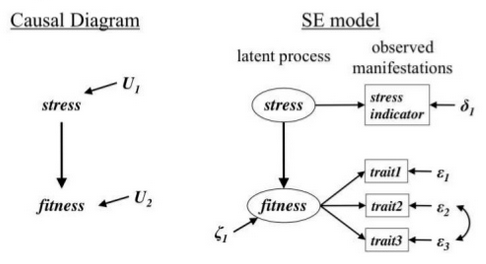
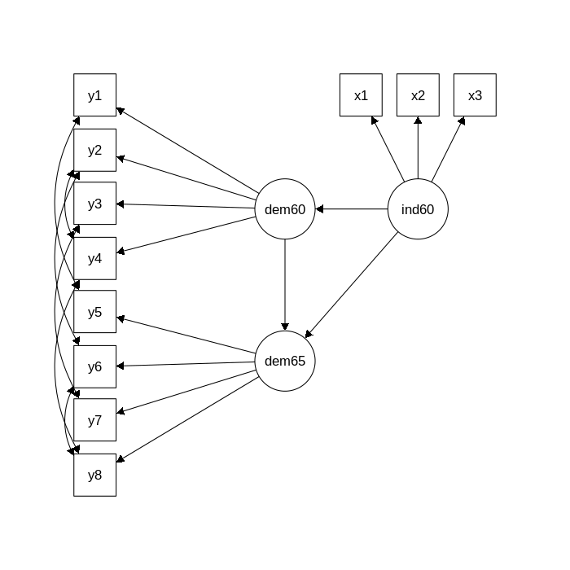
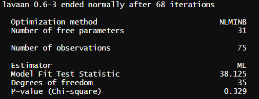
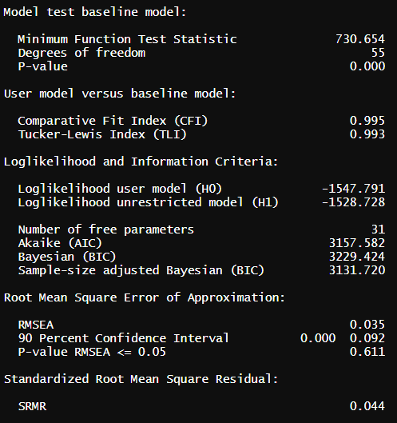
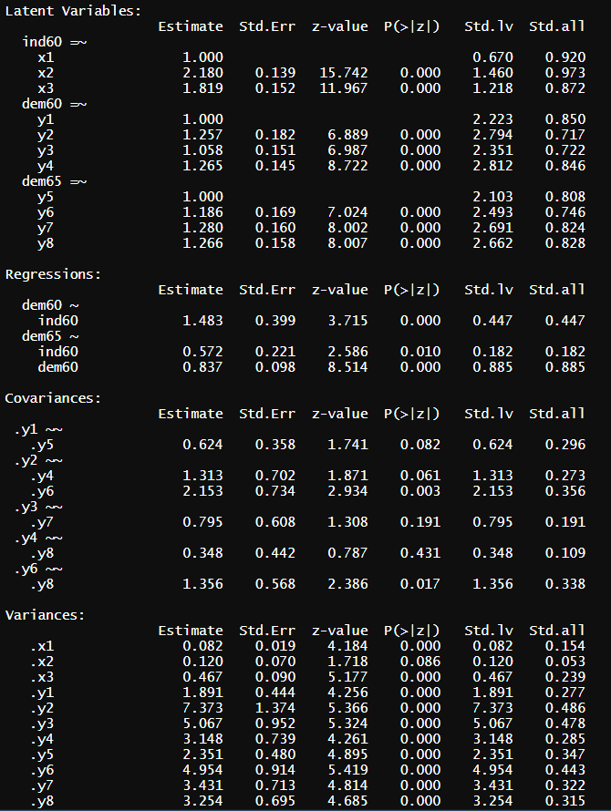
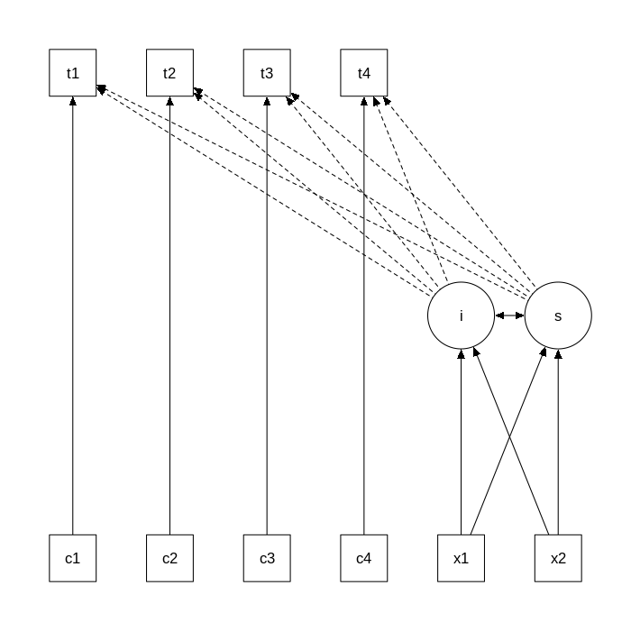

```{r setup, include=FALSE}
options(htmltools.dir.version = FALSE, scipen = 999)
set.seed(123)
knitr::opts_chunk$set(
  message = FALSE, 
  warning = FALSE, 
  error = FALSE,
  eval = FALSE)

library(tidyverse)
```

# Requirements

Install {lavaan} and {semPlot} packages

```{r, eval=TRUE}
#install.packages("lavaan")
#install.packages("semPlot")

library(lavaan)

library(semPlot)
```

---

# Structural Equation Models in a nutshell

Explore relationship with variables

Confirm if new data are fitting an existing model

Two types of variables
* Manifest (real measurment represented by squares in the model)
* Latent (abstract underlying variable measured inderectly from manifest variables represented by circles)

Causal link between manifest variables and a latent variable

```{r, eval = TRUE, echo = FALSE, out.width = "50%"}

```

---

# Using Lavaan for SEM

The lavaan package is developed to provide useRs, researchers and teachers a free open-source, but commercial-quality package for latent variable modeling. 

You can use lavaan to estimate a large variety of multivariate statistical models, including path analysis, confirmatory factor analysis, structural equation modeling and growth curve models.

All information about how to use Lavaan: http://lavaan.ugent.be/

```{r, eval = TRUE, echo = FALSE, out.width = "50%"}

```

---

# Model formula

* `=~` for the latent variables

* `~` for the regressions

* `~~` for the residual covariances in the manifest variables

you can choose between a user-friendly interface (in combination with the fitting functions `cfa()`, `sem()`, `growth()`) or a low-level interface (using the fitting function lavaan() where 'defaults' do not get in the way)

---

# The model

.pull-left[
```{r, eval = TRUE, echo = FALSE, out.width = "150%"}

```
]

.pull-right[
```{r, eval=TRUE}
model <- "
   # latent variables
     ind60 =~ x1 + x2 + x3
     dem60 =~ y1 + y2 + y3 + y4
     dem65 =~ y5 + y6 + y7 + y8
   # regressions
     dem60 ~ ind60
     dem65 ~ ind60 + dem60
   # residual covariances
     y1 ~~ y5
     y2 ~~ y4 + y6
     y3 ~~ y7
     y4 ~~ y8
     y6 ~~ y8
"
```

]

---

# Run the model

```{r, eval=TRUE}
data(PoliticalDemocracy)

fit <- lavaan::sem(model = model, data = PoliticalDemocracy)
```

---

# Check results

1. Loading: strenght of the relaship between latent and manifest variables (Std.all > 0.3 acceptable)
2. Fit Indices (Goodness and Badness)

```{r}
summary(fit)
```

```{r}
summary(fit, standardized = TRUE, fit.measures = TRUE)
# x1 correspond to 1 (scaling of the manifest variables)
```

The argument standardized=TRUE augments the output with standardized parameter values. Two extra columns of standardized parameter values are printed. In the first column (labeled Std.lv), only the latent variables are standardized. In the second column (labeled Std.all), both latent and observed variables are standardized. The latter is often called the 'completely standardized solution'.

---

# What does summary output actually mean?

```{r, eval = TRUE, echo = FALSE, out.width = "100%"}

```

* this is a **good** fit
* P-value represent the probability you will reject your null hypothesis but in this case the null hypothesis is that your model is the right fit for your data. You can use `modindices(fit)` to look for possible missing links.

---

# What does summary output actually mean?

.pull-left[
```{r, eval = TRUE, echo = FALSE, out.width = "100%"}

```
]

.pull-right[
* Model test baseline model -> to be significantly different
* User model versus baseline model -> to be the closest to 1 as possible
* Loglikelihood and Information Criteria -> the smallest possible
* Root Mean Square Error of Approximation -> the smallest possible and non significant
* Standardized Root Mean Square Residual -> the smallest possible
]
---

# What does summary output actually mean?

```{r, eval = TRUE, echo = FALSE, out.width = "50%"}

```

---

# Extracting information

## parameterEstimates()

The parameterEstimates function extracts not only the values of the estimated parameters, but also the standard errors, the z-values, the standardized parameter values, and returns everything conveniently as a data frame.

```{r}
parameterEstimates(fit)
```

The standardizedSolution() function is similar to the parameterEstimates() function, but only shows the unstandardized and standardized parameter estimates.

## fitMeasures()

The fitMeasures() function returns all the fit measures computed by lavaan as a named numeric vector. 

```{r}
fitMeasures(fit)
```

---

# Check the structure (1)

```{r, eval=TRUE}
semPlot::semPaths(fit)
```

---

# Check the structure (2)

```{r, eval=TRUE}
semPlot::semPaths(fit, what='std',curvePivot = TRUE, fade=FALSE)
```

---

# Multiple groups

```{r}
PoliticalDemocracy_group <- PoliticalDemocracy %>% 
  dplyr::mutate(group_demo = c(rep("group1",40), rep("group2",35)))

fit <- lavaan::sem(
  model = model, 
  data = PoliticalDemocracy_group, 
  group = "group_demo")
```

---

# Multilevel SEM

If the data is clustered, one way to handle the clustering is to use a multilevel modeling approach.

```{r}
data(Demo.twolevel)

model <- '
 level: 1
  fw =~ y1 + y2 + y3
  fw ~ x1 + x2 + x3
 level: 2
  fb =~ y1 + y2 + y3
  fb ~ w1 + w2
'

fit <- sem(model = model, data = Demo.twolevel, cluster = "cluster")
```

---

# Latent growth curve models

Growth modeling is often used to analyze longitudinal or developmental data. In this type of data, an outcome measure is measured on several occasions, and we want to study the change over time.

.pull-left[
```{r, eval = TRUE, echo = FALSE, out.width = "150%"}

```
]

.pull-right[
```{r}
data(Demo.growth)

model <- '
# intercept and slope with fixed coefficients
 i =~ 1*t1 + 1*t2 + 1*t3 + 1*t4
 s =~ 0*t1 + 1*t2 + 2*t3 + 3*t4
# regressions
 i ~ x1 + x2
 s ~ x1 + x2
# time-varying covariates
 t1 ~ c1
 t2 ~ c2
 t3 ~ c3
 t4 ~ c4
'
fit <- growth(
  model = model, 
  data = Demo.growth)
```
]

---
class: center, middle

# Thank you for your attention
don't hesitate to send me an email: damien.dupre@dcu.ie
